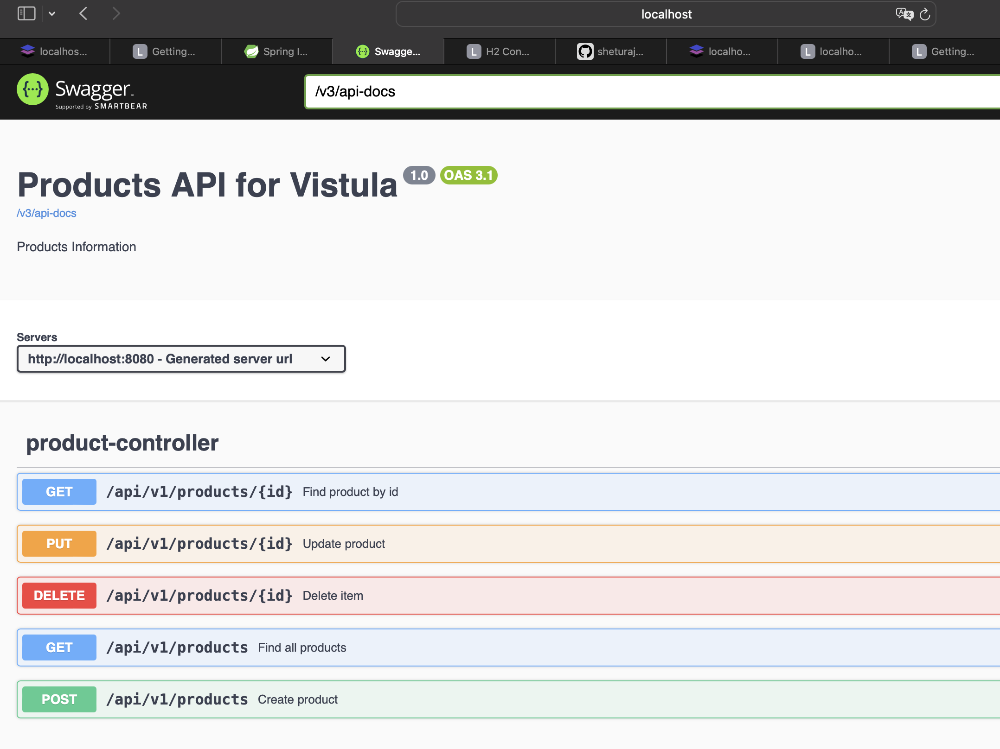
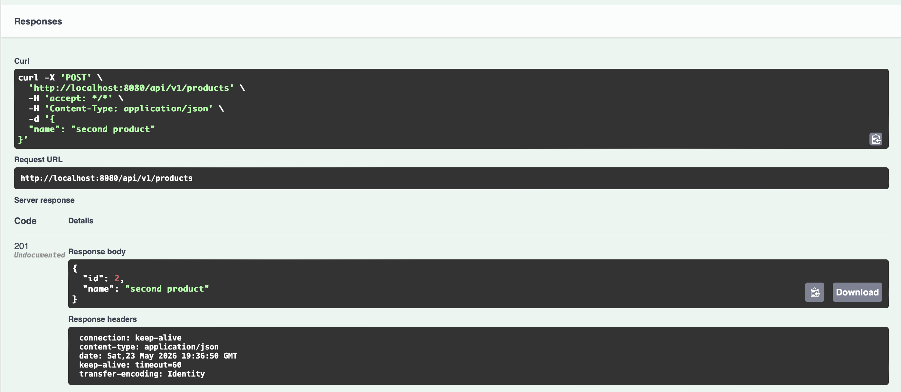
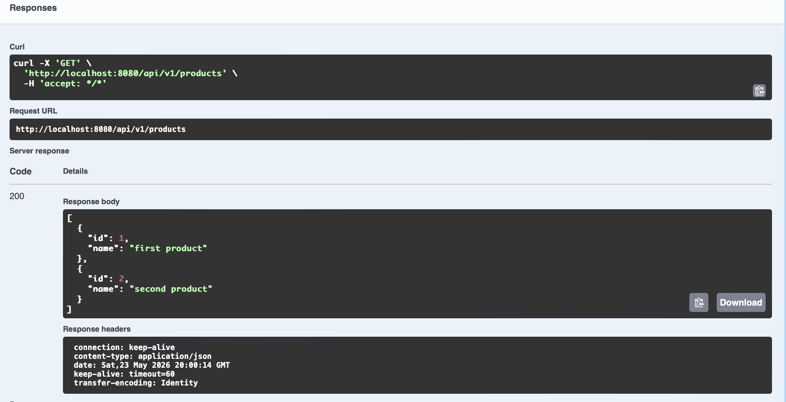
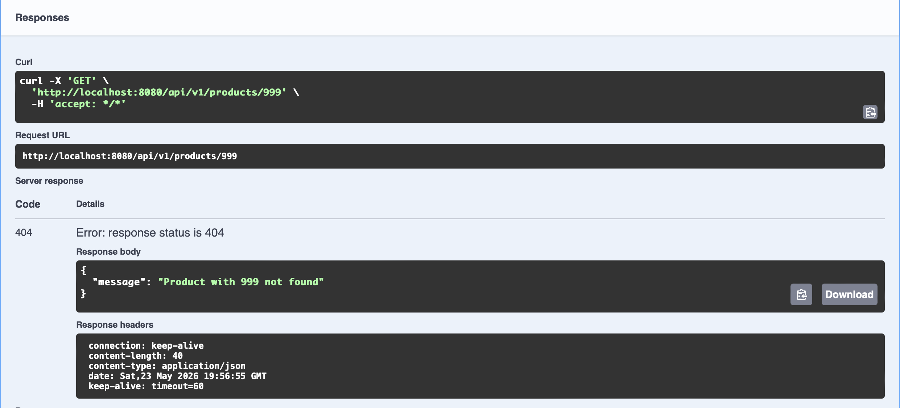
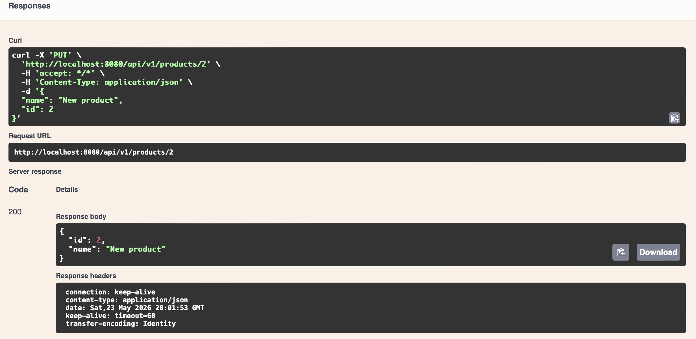
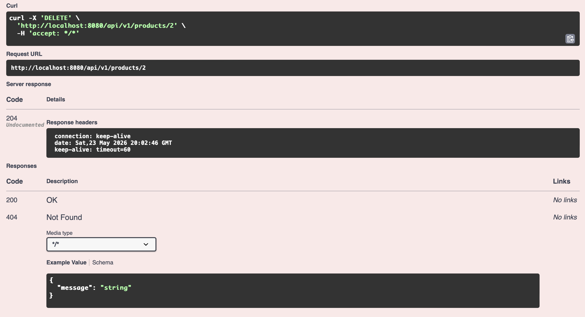
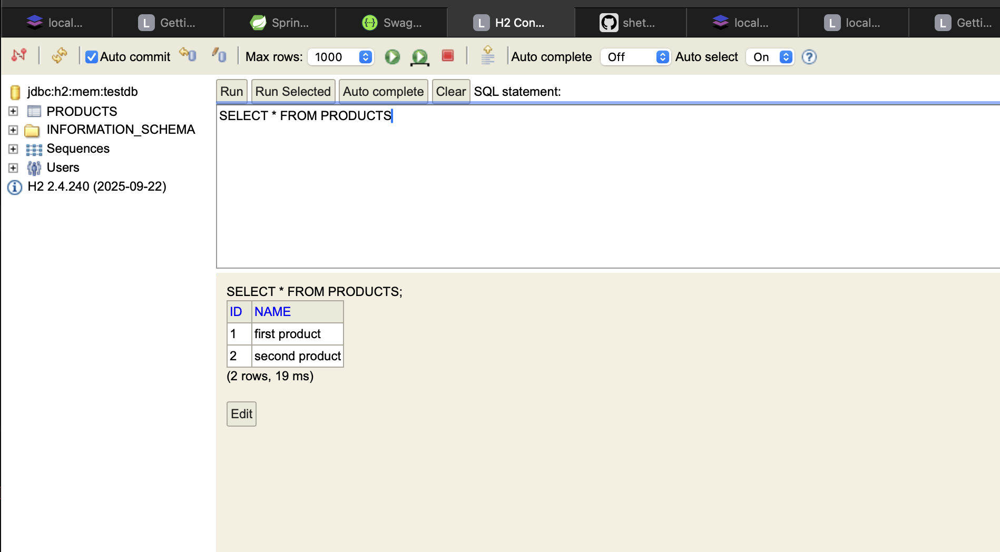
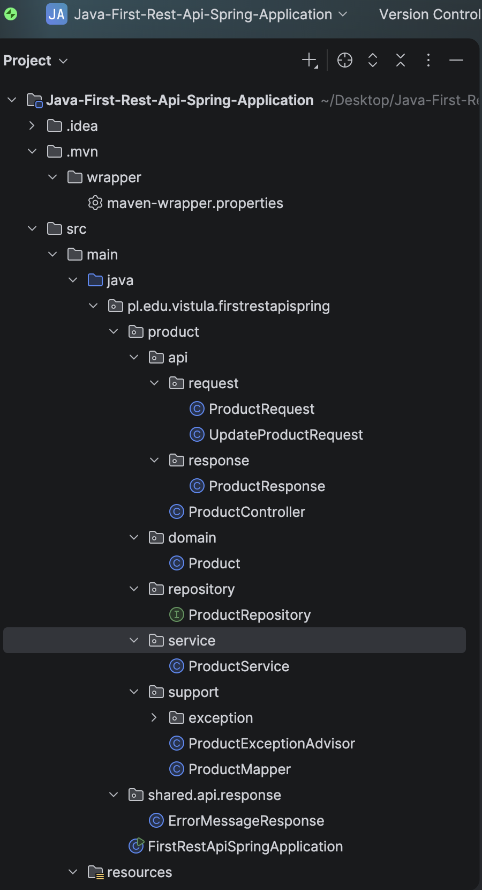

# Java-First-Rest-Api-spring-Controller

A fully functional RESTful API built with **Spring Boot**, featuring CRUD operations, Swagger UI documentation, exception handling, and an H2 in-memory database. Built as part of a university task series at **Vistula Academy of Finance and Business**.

---

## 📋 Table of Contents

- [Project Overview](#project-overview)
- [Tech Stack](#tech-stack)
- [Project Structure](#project-structure)
- [API Endpoints](#api-endpoints)
- [Screenshots](#screenshots)
- [Getting Started](#getting-started)
- [Key Concepts](#key-concepts)

---

## Project Overview

This project is a backend-only REST API (no frontend) that manages a simple `Product` resource. It was built step by step, covering:

- Setting up a Spring Boot project with Spring Initializr
- Implementing a layered architecture (Controller → Service → Repository)
- Adding Swagger UI for API documentation and testing
- Implementing proper exception handling (custom exceptions, `@ControllerAdvice`)
- Connecting to an H2 in-memory database via Spring Data JPA

---

## Tech Stack

| Technology | Purpose |
|---|---|
| Java | Primary language |
| Spring Boot | Application framework |
| Spring Web | REST API support |
| Spring Data JPA | Database abstraction layer |
| Hibernate | ORM framework |
| H2 Database | In-memory database for development |
| Springdoc OpenAPI (Swagger UI) | API documentation & testing |
| Spring Boot DevTools | Live reload during development |
| Maven | Build & dependency management |

---

## Project Structure

```
src/main/java/pl/edu/vistula/firstrestapispring/
│
├── product/
│   ├── api/
│   │   ├── request/
│   │   │   ├── ProductRequest.java         # DTO for creating a product
│   │   │   └── UpdateProductRequest.java   # DTO for updating a product
│   │   ├── response/
│   │   │   └── ProductResponse.java        # DTO for API responses
│   │   └── ProductController.java          # REST controller (handles HTTP requests)
│   │
│   ├── domain/
│   │   └── Product.java                    # JPA Entity
│   │
│   ├── repository/
│   │   └── ProductRepository.java          # JpaRepository interface
│   │
│   ├── service/
│   │   └── ProductService.java             # Business logic
│   │
│   └── support/
│       ├── exception/
│       │   ├── ProductNotFoundException.java       # Custom exception
│       │   └── ProductExceptionSupplier.java       # Supplier for exceptions
│       ├── ProductExceptionAdvisor.java            # @ControllerAdvice handler
│       └── ProductMapper.java                      # Object mapper (DTO ↔ Entity)
│
├── shared/
│   └── api/
│       └── response/
│           └── ErrorMessageResponse.java   # Wrapper for error messages
│
└── FirstRestApiSpringApplication.java      # Main application entry point
```

---

## API Endpoints

| Method | Endpoint | Description | Response Code |
|---|---|---|---|
| `POST` | `/api/v1/products` | Create a new product | `201 Created` |
| `GET` | `/api/v1/products` | Get all products | `200 OK` |
| `GET` | `/api/v1/products/{id}` | Get product by ID | `200 OK` / `404 Not Found` |
| `PUT` | `/api/v1/products/{id}` | Update a product | `200 OK` |
| `DELETE` | `/api/v1/products/{id}` | Delete a product | `204 No Content` |

### Example Request – Create Product

```json
POST /api/v1/products
Content-Type: application/json

{
  "name": "First product"
}
```

### Example Response

```json
{
  "id": 1,
  "name": "First product"
}
```

### Error Response (404)

```json
{
  "message": "Product with 999 not found"
}
```

---

## Screenshots

### Swagger UI – API Overview
The Swagger UI provides an interactive interface to test all endpoints. Accessible at:  
`http://localhost:8080/swagger-ui/index.html`



---

### POST – Create Product
Creating a new product via Swagger returns `201 Created` with the saved product including its generated ID.



---

### GET – Find All Products
Fetching all products returns a JSON array of all stored products.



---

### GET – Find One Product by ID
Fetching a specific product by its ID returns a single product object with `200 OK`.


---

### GET – 404 Not Found (Exception Handling)
When requesting a product that doesn't exist, the API returns `404 Not Found` with a descriptive error message — handled by `ProductExceptionAdvisor` using `@ControllerAdvice`.



---

### PUT – Update Product
Sending a `PUT` request with updated data returns the modified product with `200 OK`.



---

### DELETE – Delete Product
Deleting a product by ID returns `204 No Content` on success.



---

### H2 Console – Database View
The H2 in-memory database is accessible during runtime at `http://localhost:8080/console`.  
Running `SELECT * FROM PRODUCTS` shows all persisted records.

.png)


---

### Project Structure in IntelliJ
The layered package structure follows good Spring Boot architecture practices.



---

## Getting Started

### Prerequisites

- Java 17+
- Maven
- IntelliJ IDEA (recommended)

### Run the Application

```bash
# Clone the repository
git clone https://github.com/YOUR_USERNAME/YOUR_REPO_NAME.git

# Navigate to the project directory
cd YOUR_REPO_NAME

# Build and run
./mvnw spring-boot:run
```

### Access Points

| URL | Description |
|---|---|
| `http://localhost:8080/swagger-ui/index.html` | Swagger UI |
| `http://localhost:8080/v3/api-docs` | OpenAPI JSON docs |
| `http://localhost:8080/console` | H2 Database Console |

### H2 Console Login

- **JDBC URL:** `jdbc:h2:mem:testdb`
- **Username:** `sa`
- **Password:** _(leave blank)_

---

## Key Concepts

### Layered Architecture

```
HTTP Request
     ↓
ProductController       (@RestController)
     ↓
ProductService          (@Service) — business logic
     ↓
ProductRepository       (@Repository) — JpaRepository
     ↓
H2 Database             (via Hibernate/JPA)
```

### Object Mapping

`ProductMapper` (@Component) converts between:
- `ProductRequest` → `Product` (entity)
- `Product` → `ProductResponse` (DTO)

### Exception Handling

- `ProductNotFoundException` extends `RuntimeException` with a descriptive message
- `ProductExceptionSupplier` provides a `Supplier<ProductNotFoundException>` for use with `orElseThrow()`
- `ProductExceptionAdvisor` annotated with `@ControllerAdvice` catches exceptions and returns proper HTTP status codes and error bodies

### Why is `ProductRepository` empty?

`ProductRepository` extends `JpaRepository<Product, Long>`, which already provides implementations for `save()`, `findById()`, `findAll()`, and `deleteById()` through Spring Data JPA — no custom code needed for standard CRUD operations.

---
